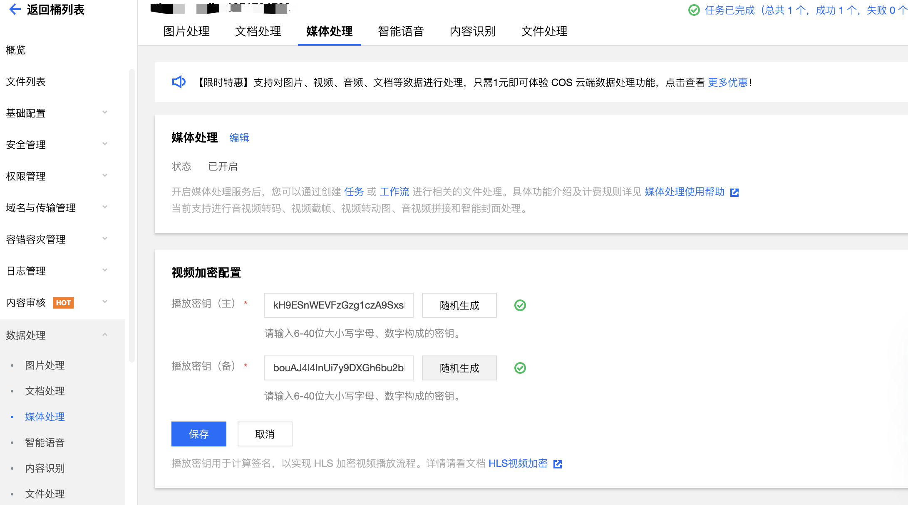
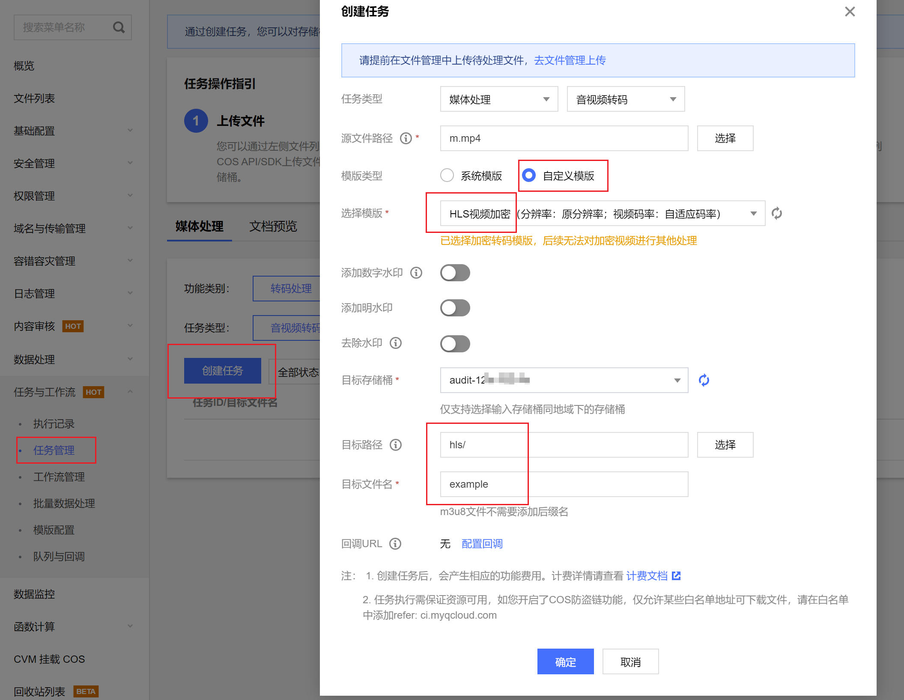

# COS HLS 解密代理服务示例

## 示例文件说明

cos-hls-player-proxy.js // 最终用于被 pc 代码引用
demo-pc-release.js // 作为代码示例，pc 代码调用示例
demo-local-proxy.js // 可用于本地体验流程

## 体验步骤

### 一、前期准备

1. 到腾讯云控制台获取 SecretId、SecretKey [获取密钥](https://console.cloud.tencent.com/capi)
2. 到 COS 控制台存储桶获取播放密钥 playKey [COS控制台](https://console.cloud.tencent.com/cos/bucket)
   
3. 到 COS 控制台存储桶详情里，配置 CORS，允许 http://127.0.0.1:3000 访问。
   

### 二、创建 HLS 加密视频
1. 登录 对象存储控制台。
2. 在左侧导航栏中，单击存储桶管理，进入存储桶列表。
3. 找到您需要存储视频的存储桶，并单击右侧操作栏的管理，进入相应存储桶管理页面。
4. 单击左侧的任务和工作流，选择模板配置页签，进入模板配置页面。
5. 选择音视频转码，单击创建转码模板，弹出创建转码模板窗口。
6. 在创建音视频转码模板窗口中，配置如下基本信息后，点击下一步。
   ！[加密转码模板](https://qcloudimg.tencent-cloud.cn/image/document/2858e5465599929e60355b066afdee48.png)
7. 视频参数和音频参数选择默认配置。
8. 配置如下高级设置后，点击完成。
   
9. 完成 HLS 加密模板配置，后续选用此模板 配置工作流 或 配置任务 即可实现加密视频。
10. 当前实例里，可以通过创建转码任务，选中刚才创建的 HLS 加密转码模板，对已上传的 mp4 文件转码，转码完后即可得到加密后的 m3u8 和 ts 文件。
    

### 三、启动本地解密代理服务

1. 对步骤一里拿到的 SecretId、SecretKey、playKey、bucket、region 放到 demo-server.js 里
2. 安装依赖，并启动解密服务
``` bash
npm i # 安装依赖
node demo-server.js # 启动node服务
```
3. 命令行会打开本地访问地址和端口，可以在浏览器打开 http://127.0.0.1:<port>，端口每次是随机占用。

### 四、在播放端使用该代理服务播放视频

正式环境是在客户端的 html 里实现调用解密代理服务，当前示例为了方便体验，在同一个服务里，起了静态文件、token 服务。
尝试播放视频：
1. 修改 client/pc-proxy-cdn.html 里的 m3u8Url，改为刚才步骤二里在控制台转码好的加密视频 .m3u8 文件，复制文件链接。
2. 在浏览器访问 pc-proxy-cdn.html 实例，可以看到视频能正常播放，经过代理服务提供的 getM3u8 和 getKey 接口，完成了 HLS 加密视频正常播放。


## CDN 加速域名场景

1. 如果访问的 m3u8 地址是 CDN 域名，且有设置缓存时间，需要对 .m3u8 后缀的文件设置为 CDN 节点不缓存。

## 【注意】线上使用注意

1. 安装依赖
```shell
npm i cos-hls-player-proxy
```
2. 参考 demo-pc.js 文件在 PC 端 nodejs 代码调用启动服务
```javascript
var playerProxy = require('cos-hls-player-proxy');
playerProxy.start(function (err, data) {
    if (err) return console.error('playerProxy start error', err);
    console.log('play proxy ready!', data.url);
});
```
3. 参考 client/pc-proxy-cdn.html 文件，在播放器的逻辑里实现通过该代理服务，完成完整的视频播放过程。
